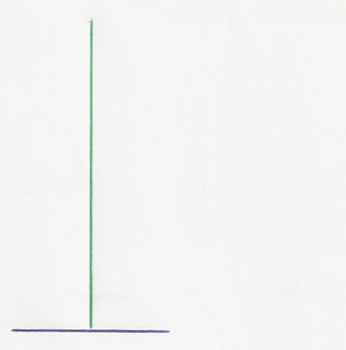

# Hangman Game - Python Project with Pygame

 <!-- Replace with a representative image of your game -->

## Description

This project is an implementation of the classic Hangman game using Python and the Pygame library. The game offers a fun and interactive way to test your vocabulary skills while enjoying a visually engaging experience. Players can choose their difficulty level, add new words to the game, and track their scores on a scoreboard.

## Features

- **Interactive Gameplay**: Guess letters to uncover the hidden word before running out of attempts.
- **Difficulty Levels**: Choose between "Easy" and "Hard" modes for a tailored challenge.
- **Custom Word Addition**: Add new words to the game's word list.
- **Scoreboard**: Track your scores and compete with others.
- **Sound Effects**: Enjoy immersive sound effects for winning and losing.
- **Visual Feedback**: Watch the hangman figure evolve as you make incorrect guesses.

## Installation

### Prerequisites

Before running the game, ensure you have the following installed:

- Python 3.x
- Pygame library

### Steps

1. **Clone the Repository**:
   ```bash
   git clone https://github.com/your-username/hangman-game.git
   cd hangman-game
Install Pygame:
If you don't have Pygame installed, you can install it using pip:

bash
Copy
pip install pygame
Download Fonts and Assets:

Place the Ubuntu-Regular.ttf font file in the project directory.

Ensure the images and sounds folders are correctly populated with the required assets.

Run the Game:
Execute the main script to start the game:

bash
Copy
python main.py
How to Play
Start the Game:

Launch the game and enter your name when prompted.

Choose your preferred difficulty level ("Easy" or "Hard").

Gameplay:

Guess letters one at a time to reveal the hidden word.

Correct guesses will fill in the blanks, while incorrect guesses will bring you closer to losing.

You have a limited number of attempts based on the difficulty level.

Winning and Losing:

If you guess the word correctly, you win and your score is saved.

If you run out of attempts, you lose, and the correct word is revealed.

Additional Features:

Add Words: Use the "Enter a word" option in the menu to add new words to the game.

Scoreboard: Check the scoreboard to see your ranking and previous scores.

Project Structure
Copy
hangman-game/
├── images/                # Contains hangman images for each game step
├── sounds/                # Contains sound effects for winning and losing
├── mots.txt               # Text file containing the list of words
├── score.txt              # Text file storing player scores
├── main.py                # Main game script
├── README.md              # Project documentation
└── Ubuntu-Regular.ttf     # Font used in the game
Contributing
Contributions are welcome! If you'd like to contribute to this project, please follow these steps:

Fork the repository.

Create a new branch for your feature or bugfix.

Commit your changes.

Submit a pull request with a detailed description of your changes.

License
This project is licensed under the MIT License. See the LICENSE file for details.

Acknowledgments
Thanks to Pygame for providing the framework for this game.

Special thanks to my teammates Khady and Paul-E for their collaboration on this project.

Enjoy playing the Hangman Game! If you have any questions or feedback, feel free to open an issue or contact me.
